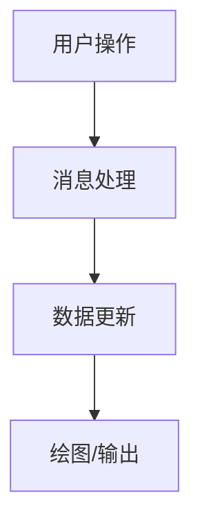

# CLASS-AI 输出模板

Agent 最终输出尽量按这个结构组织。

## 1. 本节课知识点

```markdown
| 知识点 | 简单解释 | 来自课堂哪里 | 适合做成什么功能 |
|---|---|---|---|
```

## 2. 知识点到实验映射

```markdown
| 课堂知识点 | 对应代码/操作 | 程序表现 | 演示方法 | 学生讲法 |
|---|---|---|---|---|
```

## 3. 课上 AI 互动

```text
问题 1：
老师怎么问：
AI 预期输出：
学生要判断：
老师修正点：
建议用时：
```

## 4. 最小可运行基线

```text
版本 0：
目标：
对应知识点：
实现内容：
如何验证：
```

## 5. 逐步改进路线

```markdown
| 版本 | 新增内容 | 对应知识点 | 验证方式 |
|---|---|---|---|
```

## 6. 项目结构

```text
project/
  src/
  README.md
```

## 7. 架构图/流程图

优先输出 Mermaid：



## 8. 关键代码/关键步骤讲解

```markdown
### 函数/步骤名

作用：
对应课堂知识点：
为什么需要：
学生怎么讲：
```

## 9. 验收讲稿

```text
30 秒简介：

2 分钟技术讲解：

关键演示步骤：
```

## 10. 老师可能提问

```markdown
### Q1：
A：
```

## 11. 学生复盘

```text
AI 帮我做了什么：
我自己修改/验证了什么：
我学到的课堂知识点：
我还不懂的问题：
```

